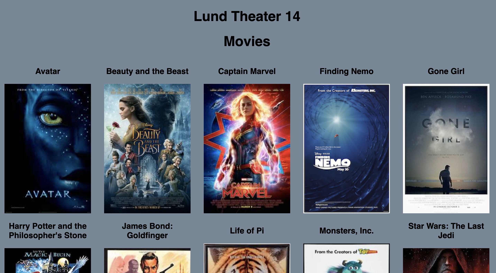
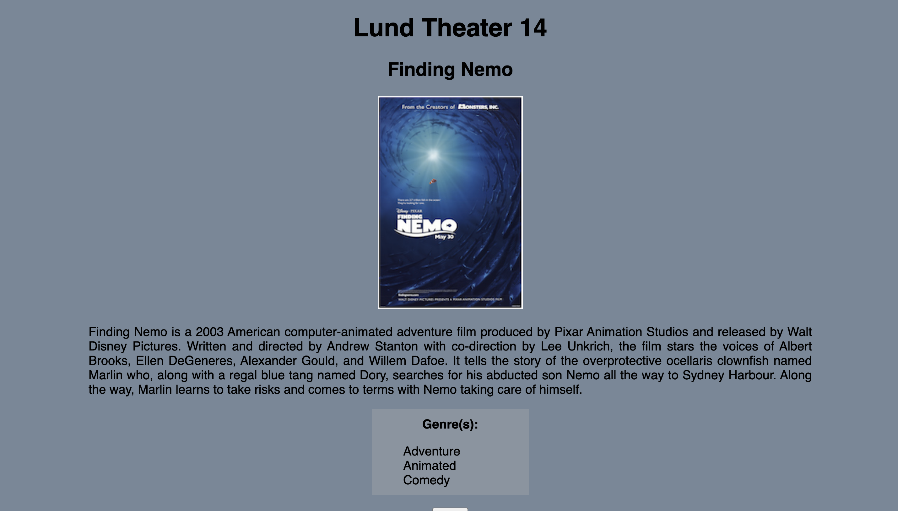

# Movie List

## Description

_Duration: 6 hours_

This weekend project was about using everything we have learned the past 12 weeks at Prime Digital Academy. We were tasked with utilizing React Redux and React Sagas to make this app more functional. As a user you are able to click on any movie poster and you will be taken to a details page for that movie.

## Preview

### Prerequisites

- [Node.js](https://nodejs.org/en/)

## Installation

1. Create a database named `saga_movies_weekend`,
2. The queries in the `database.sql` file are set up to create all the necessary tables and populate the needed data to allow the application to run correctly. The project is built on [Postgres](https://www.postgresql.org/download/), so you will need to make sure to have that installed. We recommend using Postico to run those queries as that was used to create the queries, 
3. Open up your editor of choice and run an `npm install`
4. Run `npm run server` in your terminal
5. Run `npm run client` in your terminal
6. The `npm run client` command will open up a new browser tab for you!

## Built With
- JavaScript
- React
- React Redux
- React Sagas
- CSS

## Acknowledgement
Thanks to [Prime Digital Academy](www.primeacademy.io) who equipped and helped me to make this application a reality. (Thank your people)
